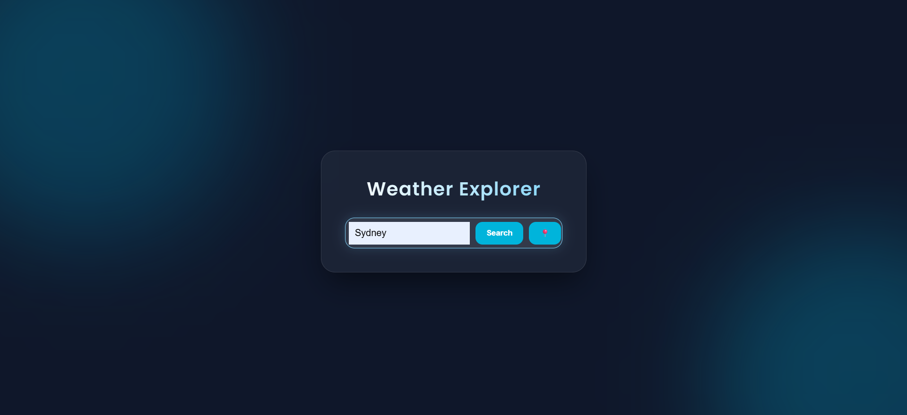

# 🌤️ Weather Explorer

A modern, responsive weather application built with HTML5, CSS3, and JavaScript. This app fetches real-time weather data and 5-day forecasts using the OpenWeatherMap API.

## ✨ Features
- **Real-time Data:** Fetches current temperature, humidity, and wind speed.
- **5-Day Forecast:** Displays daily weather predictions with smooth animations.
- **Dynamic Backgrounds:** The UI theme changes based on weather conditions (Sunny, Rainy, Cloudy).
- **Geolocation Support:** Automatically detects your location with one click.
- **Modern UI:** Glassmorphism design with animated background blobs and floating icons.

## 📸 Screenshots
| Main Dashboard | Mobile View |
|---|---|
|  |  |

## 🚀 Live Demo
Check out the live project here: [Your GitHub Pages Link Here]

## 🛠️ Built With
- **HTML5:** Semantic structure.
- **CSS3:** Flexbox, Grid, Glassmorphism, and @keyframes animations.
- **JavaScript:** Fetch API (Async/Await), Geolocation API, and DOM Manipulation.
- **API:** [OpenWeatherMap](https://openweathermap.org/)

## ⚙️ How to Run
1. Clone the repository.
2. Open `index.html` in any modern web browser.
3. Enter your city or click the 📍 icon.

## 📝 License
This project is open-source and available under the MIT License.
